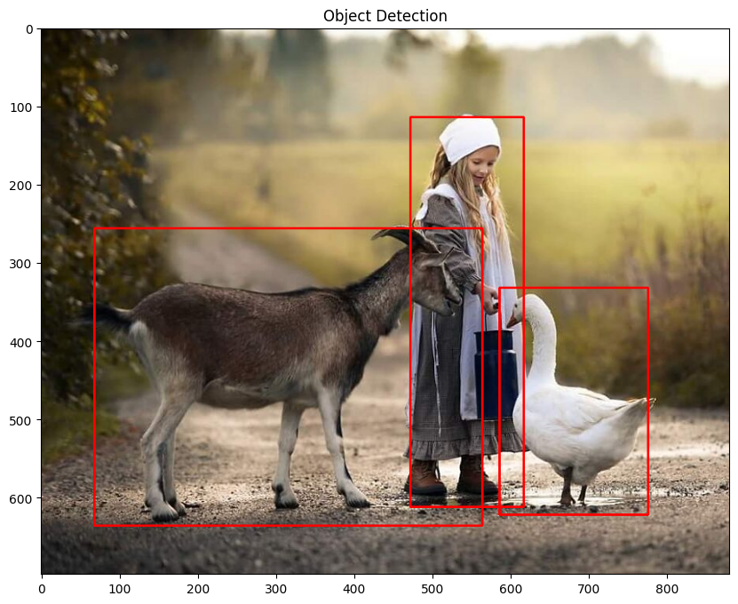

# AI Object Detection using TensorFlow Hub
------------------------------------------

## 📌 Overview

This project demonstrates an AI-based object detection system using a pre-trained deep learning model from TensorFlow Hub.

Users can upload any image, and the model detects objects by drawing bounding boxes around them.

## Features

* Upload any image dynamically
* Uses pre-trained SSD MobileNet V2 model
* Detects multiple objects in an image
* Displays bounding boxes on detected objects
* Built using Google Colab

##  Technologies Used

* Python
* TensorFlow
* TensorFlow Hub
* OpenCV
* NumPy
* Matplotlib

##  How to Run

1. Open the notebook in Google Colab
2. Run all cells
3. Upload an image when prompted
4. View detected objects in output

##  Sample Output

## Model Used

SSD MobileNet V2 (TensorFlow Hub)

##  Note

This model works best on real-world images. Cartoon or illustrated images may not be detected accurately.
